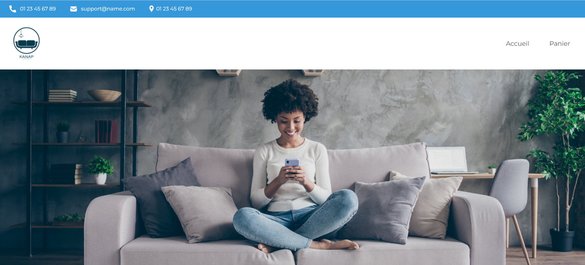
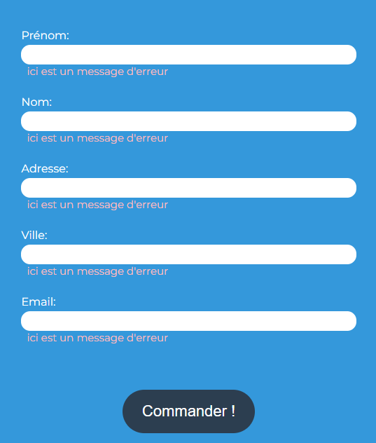
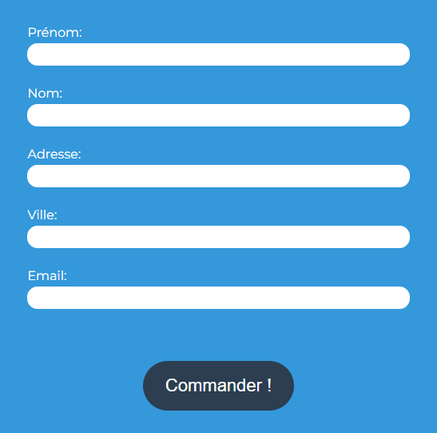
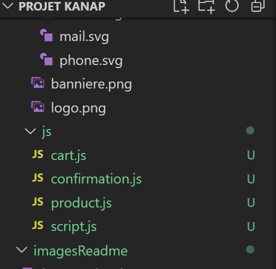
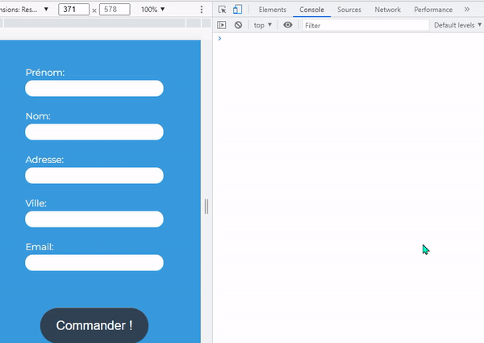
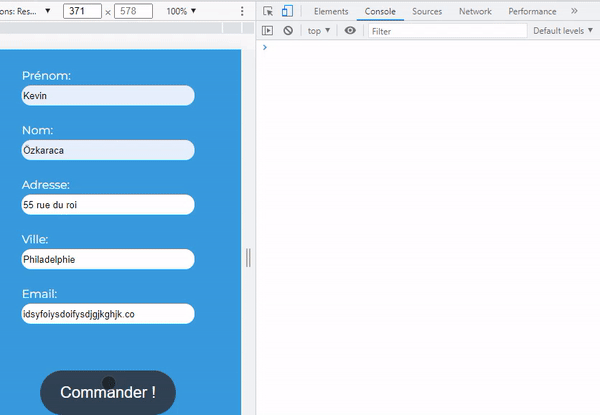
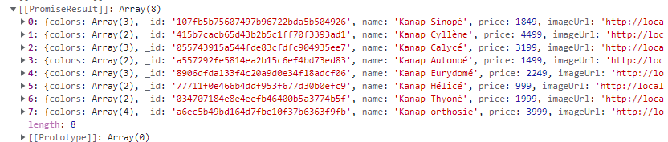

### Projet de formation :

 

  

 

### Quel est le but de ce projet ?

Le but de ce projet est de nous faire travailler avec le langage JavaScript et de lier le front (affichage client) au back (l'arrière plan du site). Puisque le sujet est un exercice de formation je ne pourrais pas vraiment détailler les étapes de mon travail mais je vais tout de meme présenter celui-ci de la meilleure manière possible.

### La mise en place :

J'ai mis en place les fichiers et lu l'ensemble des documents donnés par le centre de formation. Des messages doivent etre affichés en cas d'erreur, des produits doivent apparaitre de manière dynamique (un code doit aller chercher les informations et les afficher en fonction de la réponse donnée). Voici un exemple :

 

  
  

 

### Mise en place des fichiers JavasCript :

Git (un programme de suivi de version) me permet de savoir quel fichier est nouveau, modifié ou supprimé dans mon projet. J'ai mis en place les fichiers JavaScript dans un dossier avec les noms donnés dans les codes de chaques pages. Une partie va servir à l'affichage client et une autre va servir à l'affichage de test en console.

 

  

 

Je test les fonctionnalités en affichant des messages en console, il existe un onglet pour le developpement sur le navigateur qui nous permet de verifier si notre code est valable ou pas.

 

  

 

J'ai mis en place des "Regex" une sorte de barrière à formulaire, qui empèche les formulaires mal remplis d'etre validés. Pour l'instant du texte informe de la validité ou pas des entrés, ensuite je devrais mettre en place une action lié au panier client et la validation de la commande. On peut voir ici que l'adresse mail n'est pas conforme :

 

  

 

### Mise en place des elements de l'API :

Je commence a afficher en console les elements présents sur le serveur (fictif). Pour l'instant ça ne ressemble pas à grand chose mais ceux sont les éléments que je devrai afficher sur le site par la suite. J'essaie de les cibler et de les afficher dans un tableau dans un premier temps. A suivre...

 

  

 

### Mes reseaux sociaux : 

    

            
            
             
            
            
            
            
            
    
  

